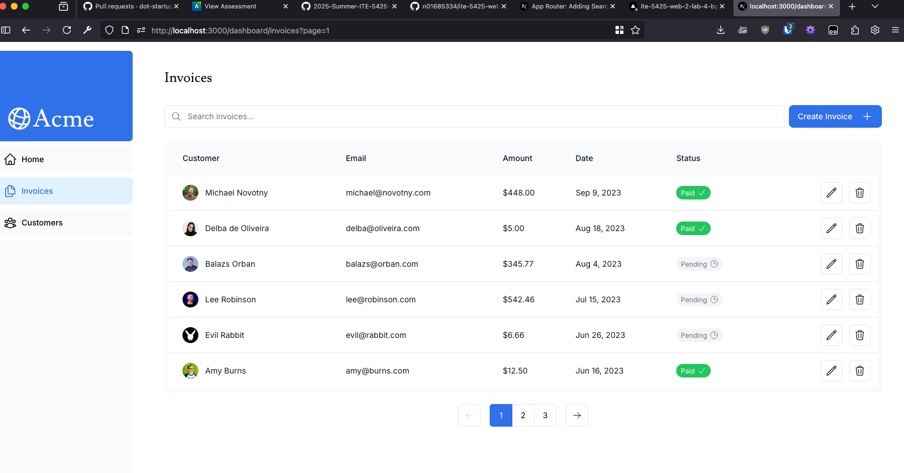

# ITE-5425 Lab 4 | NextJS Pagination, Search, Data fetching

Student: James Chard - N01685334

# DEPLOYMENT

https://ite-5425-web-2-lab-4-bgp1-jp543uwnb-james-cs-projects-6e4c82b7.vercel.app/dashboard

## Overview

- Complete chapters 6-11 of the NextJS dashboard starter tutorial:
  - deploy vercel project, database, and make connection
  - seed database
  - Different kinds of rendering patterns(server side, partial prerendering, suspense, etc.)
  - implement dashboard with real database data, and search/pagination for invoices

## Challenges / learning

- Cool to see the new experimental partial prerendering features
- Nice to see there's a good package for debouncing now and we dont have to implement it ourselves

## Screenshots

 
